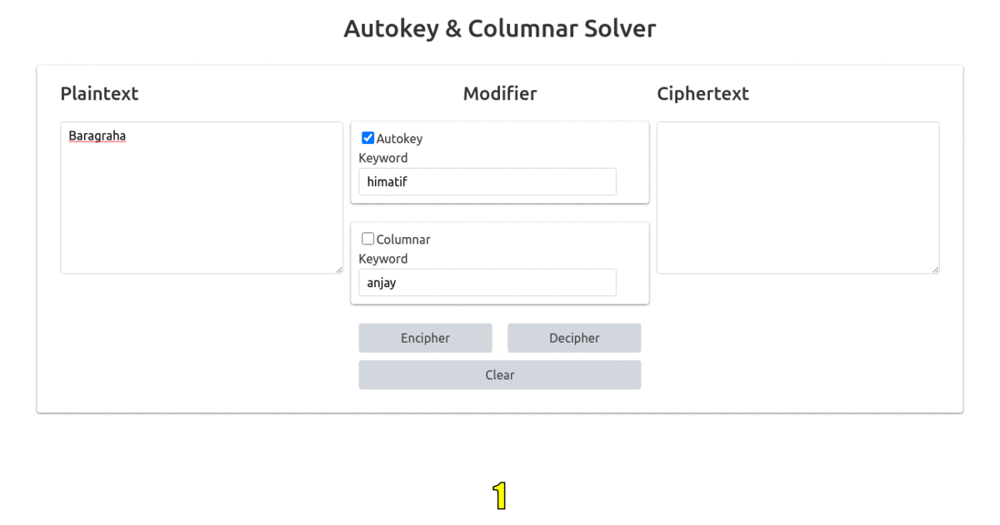
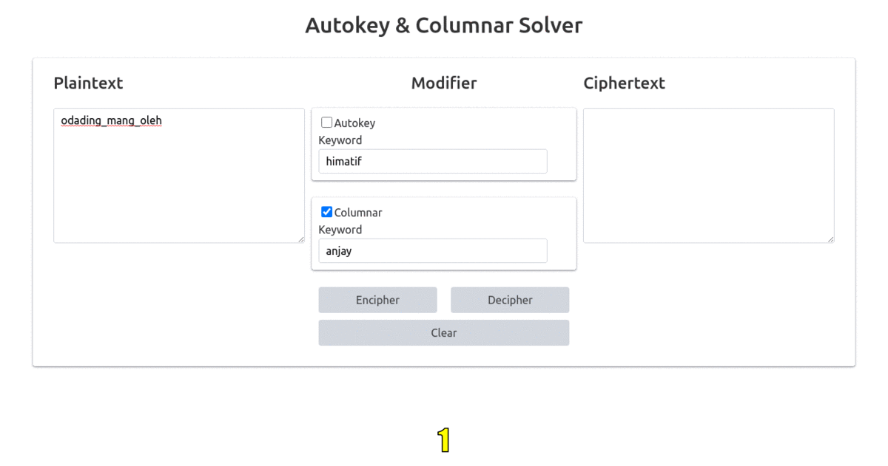

# Simple Autokey Cipher and Columnar Transposition Solver App

A simple HTML + Javascript app that encipher plaintext consists of alphabet letters with either Autokey Cipher or Columnar Transposition or both consecutively.

Demo Screenshot :
- Autokey

- Columnar

- Both consecutively
